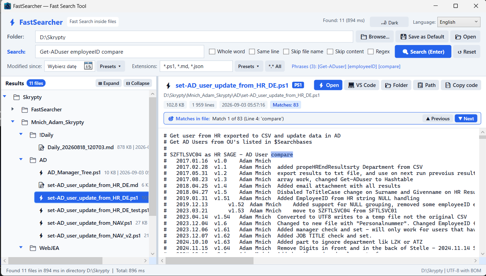
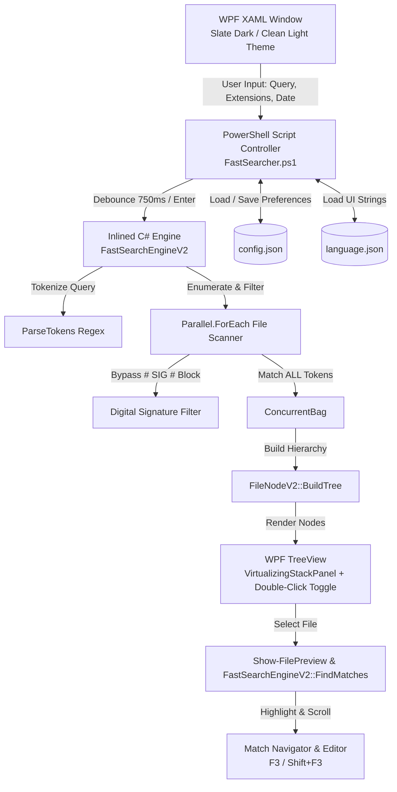

# FastSearcher — Fast Multi-Threaded Search In File Content

[](https://github.com/PowerShell/PowerShell)
[](https://docs.microsoft.com/en-us/dotnet/desktop/wpf/)
[](https://learn.microsoft.com/en-us/dotnet/api/system.threading.tasks.parallel.foreach)
[](#3-dynamic-light--dark-themes-with-windows-dwm-integration)
[](https://en.wikipedia.org/wiki/Byte_order_mark)
[](language.json)

**FastSearcher** is an advanced, multi-threaded desktop search application built with PowerShell and WPF with dynamic **Slate Dark** and **Clean Light** themes. It is designed to scan thousands of scripts, configuration files, Markdown documents, Office documents (Excel, Word, PowerPoint, OpenDocument, legacy XLS/DOC), and searchable PDF files across directory structures (such as `D:\Skrypty`) in **300–600 milliseconds**.

Powered by an in-memory compiled C# parallel search engine ([FastSearchEngineV2](FastSearcher.ps1)), **FastSearcher** delivers instant `ALL` (AND) multi-phrase matching, digital signature filtering, zero-dependency Office & PDF text extraction, hierarchical tree visualization with hardware-accelerated UI virtualization, double-click folder expansion, in-app syntax previewing with match jumping, dynamic extension & date presets, dual execution timing metrics, and full multi-language UI localization (English, German, and Polish).

---

## Quick File Links

| Component | Path | Description |
| :--- | :--- | :--- |
| **Main Script** | [FastSearcher.ps1](FastSearcher.ps1) | Primary PowerShell WPF application and compiled C# engine |
| **Configuration** | [config.json](config.json) | Persistent application settings and filter preferences |
| **Localization** | [language.json](language.json) | Multi-language catalog (English, German, Polish) |
| **Build Script** | [Build-Exe.ps1](Build-Exe.ps1) | Standalone `.exe` packaging script using PS2EXE |
| **Executable** | [FastSearcher.exe](FastSearcher.exe) | Compiled standalone windowed binary |
| **GUI Screenshots** | [Res/](Res/) | Screenshot assets: [1.png](Res/1.png), [1.1.png](Res/1.1.png), [2.png](Res/2.png), [3.png](Res/3.png) |
| **Polish Guide** | [FastSearcher.md](FastSearcher.md) | Architectural summary and documentation (Polish) |

---

## Key Features

### 1. Ultra-Fast Multi-Threaded C# Engine (`FastSearchEngineV2`)
- **Multi-Core Parallelism**: Uses `Parallel.ForEach` across all available logical CPU cores (`Environment.ProcessorCount`) to inspect file contents concurrently.
- **Sub-Second Latency**: Traverses and searches repositories of 6,000+ files in approximately **300–600 ms**.
- **Digital Signature Stripping**: Automatically detects and excludes cryptographic signature blocks (`# SIG # Begin signature block`) from search evaluations. This prevents false positive hits on common short acronyms (e.g., `BC`, `AD`, `SQL`, `NAV`) caused by random Base64-encoded digital certificates.
- **Large File Safeguard**: Automatically skips text-search inspection on individual files exceeding **25 MB** to protect memory and maintain responsiveness.
- **Asynchronous Background Search & Live Progress (v1.3)**: File scans execute entirely on a background thread pool worker via C# `Task.Run` without blocking the WPF UI thread. A dedicated 40ms `DispatcherTimer` running at `DispatcherPriority.Normal` delivers live atomic progress indicators (`"Searching... (2,915 scanned, 599 matches)"`) and displays an indeterminate progress bar.
- **Dual Performance Timing & Total UI Unlock Metric (v1.3)**: Tracks and displays two distinct performance metrics on the bottom status bar:
  1. **Core Search Time**: Time consumed by the parallel C# search engine traversing and reading files.
  2. **Total Elapsed Time**: Wall-clock duration from search trigger through background scanning, tree hierarchy construction, and complete WPF UI unlock (`"Found 599 files in 390 ms in directory D:\Skrypty  |  Total: 435 ms"`).
- **Live Search Cancellation (v1.3)**: The search button transforms into a `🛑 Cancel` button during active scans. Users can instantly cancel running scans by clicking Cancel, pressing <kbd>Esc</kbd>, or modifying the search text.

### 2. Intelligent Query Parsing & Strict "ALL" (AND) Matching
- **Multi-Word Search**: Typing `BC user compare` matches only files that contain **all three** tokens (any order, in content or file name).
- **Exact Quoted Phrases & Whitespace Preservation**: Supports double (`"AD compare"`) and single (`'AD compare'`) quotes to treat phrases with spaces as atomic search terms. Leading and trailing whitespaces inside quotes (such as `" DR "` or `"dr "`) are **never trimmed**, allowing exact whitespace-delimited targeting.
- **Negative Exclusion Tokens (v1.2)**: Exclude unwanted files by prefixing words or quoted phrases with a minus sign (e.g. `ProjectAlpha -test -"old backup"`). Files containing any excluded token in their content or name are immediately discarded.
- **Regular Expression Search Mode (v1.2)**: Dedicated `"Regex"` checkbox (`chkRegex`) evaluates search tokens as regular expressions (e.g. `ORD-\d{4,}` or `function\s+\w+`). Includes an automated **2-second timeout protection** against catastrophic backtracking (ReDoS).
- **Whole Word Matching**: Dedicated `"Whole word"` checkbox (`chkWholeWord`) restricts search tokens to standalone words bounded by standard word boundaries (`\b` or non-alphanumeric/non-underscore characters). For example, searching `DR` will match `$DR = 1` or `DR test`, but will **not** match `poDRill` or `DR_test`.
- **Same Line (Single Line) Matching**: Dedicated `"Same line"` checkbox (`chkSameLine`) restricts search results to files where **all entered search terms appear on the exact same line** (or in the file name). Uses an ultra-fast zero-allocation anchor scanner that checks candidate files without creating substring copies or array allocations.
- **Skip File Name Search**: Dedicated `"Skip file name"` checkbox (`chkSkipFileName`) excludes file names from query matching, enforcing that all search tokens must exist within the file content.
- **Skip Content Search**: Dedicated `"Skip content"` checkbox (`chkSkipFileContent`) skips reading and searching file content entirely, evaluating search tokens strictly against file names. This delivers instant, zero-I/O filename searches across tens of thousands of files.
- **Typing Search Delay (Debounce)**: Automatic search execution waits for a configurable pause in typing (default **750 ms**, set via `config.json`). While typing, the status bar displays live feedback (`"Typing... search will start shortly"`), preventing premature searches in the middle of typing multi-word phrases. Pressing <kbd>Enter</kbd> runs the search immediately with zero delay.
- **Punctuation Resilient**: Cleanses delimiters such as commas and semicolons outside quotes (e.g. `BC, user, compare`).
- **Case-Insensitive**: Performs case-agnostic lookups (`StringComparison.OrdinalIgnoreCase`).

### 3. Dynamic Light & Dark Themes with Windows DWM Integration



- **Runtime Theme Toggle**: Dedicated top-bar button (`btnThemeToggle`) allows switching instantly between **🌙 Dark** and **☀️ Light** modes with zero reload or window restart.
- **Dynamic Resource Architecture**: Every UI component binds to `DynamicResource` brush keys. Theme switching dynamically injects frozen `SolidColorBrush` instances into `Window.Resources`, updating all borders, backgrounds, controls, scrollbars, and syntax preview panes seamlessly without WPF Freezable exceptions.
- **Windows DWM Title Bar Integration**: Integrates directly with Windows Desktop Window Manager (`dwmapi.dll!DwmSetWindowAttribute`) to switch between immersive dark title bars (`DWMWA_USE_IMMERSIVE_DARK_MODE`) on Windows 10 (build 17763+) / Windows 11 and standard light title bars.
- **Curated Palettes**:
  - **Slate Dark Palette**: `#0F172A` (window background), `#1E293B` (panels), `#0A0F1D` (code editor), `#38BDF8` (highlights/caret), `#2563EB` (accent blue), `#F8FAFC` (primary text).
  - **Clean Light Palette**: `#F8FAFC` (window background), `#FFFFFF` (panels/editor), `#E2E8F0` (secondary buttons), `#CBD5E1` (borders), `#2563EB` (accent blue), `#0F172A` (primary text), `#475569` (secondary text).
- **Persistent Theme Setting**: Current theme preference is automatically saved to `config.json` (`"Theme": "Dark"` or `"Theme": "Light"`).

### 4. Dynamic File Extension Filter & Curated Presets


- **Custom Input**: Freeform editable extension box (`txtExtensions`) accepting comma-, semicolon-, or space-separated masks (e.g. `*.ps1, *.md, *.sql`, `.json .yaml`, `*.*`).
- **Extension Normalization**: Automatically converts shorthand inputs (`ps1` or `.ps1`) into valid glob patterns (`*.ps1`) and deduplicates overlapping masks using `HashSet<string>`.
- **Predefined Extension Presets Menu (`Presets ▾`)**:
  - `⚡📝 Scripts & Docs (*.ps1, *.md)` [Default]
  - `⚡ PowerShell (*.ps1, *.psm1, *.psd1)`
  - `📝 Markdown & Docs (*.md, *.txt)`
  - `🗄️ SQL Scripts (*.sql)`
  - `📦 Data & Config (*.json, *.xml, *.yaml, *.csv)`
  - `💻 All Code (*.ps1, *.sql, *.cs, *.py, *.js)`
  - `📈 Office Docs (*.xlsx, *.docx, *.pptx, *.odt, *.ods, *.xls, *.doc, *.pdf)`
  - `📈 Excel Only (*.xlsx, *.xlsm, *.xls)`
  - `🌐 All Files (*.*)`
- **Quick Extension Append Actions**:
  - `➕ Append *.sql`, `➕ Append *.json`, `➕ Append *.xml`, `➕ Append *.txt`, `➕ Append *.xlsx`, `➕ Append *.docx`, `➕ Append *.xls`, `➕ Append *.doc`, `➕ Append *.pdf`.
- **All Files Toggle (`*.* All`)**: One-click toggle button to quickly switch between unrestricted filesystem scanning (`*.*`) and previously active specific extension masks with visual active state indicator.

### 5. Dynamic Date Modification Filter & Quick Presets
- **Dynamic DatePicker**: Integrated calendar picker (`dpModifiedSince`) to filter files modified on or after any chosen cutoff date.
- **Default (All Files)**: By default, no date filter is applied (`dpModifiedSince.SelectedDate = $null`), scanning all files regardless of age.
- **Quick Date Presets Menu (`Presets ▾`)**:
  - `📅 All Dates (Default)`
  - `🕒 Today`
  - `⏱️ Last 24 Hours`
  - `📆 Last 3 Days`
  - `📆 Last 5 Days`
  - `📆 Last 7 Days (1 Week)`
  - `🗓️ Last 14 Days (2 Weeks)`
  - `🗓️ Last 30 Days (1 Month)`
  - `🗓️ Last 90 Days (3 Months)`
  - `🗓️ This Year (Since Jan 1)`
  - `↺ Clear / Show All`
- **Instant Clear Button (`✕`)**: Displays dynamically whenever a date filter is active, allowing instant 1-click reset back to all dates.

### 6. Interactive Hierarchical TreeView with Hardware Virtualization
- **Contextual Pruning**: Only directories containing matching files are displayed in the tree; empty parent branches are automatically pruned.
- **File Type Icons**: Dynamic icon rendering based on file extension:
  - ⚡ PowerShell (`.ps1`, `.psm1`, `.psd1`)
  - 📝 Markdown (`.md`, `.markdown`)
  - 🗄️ SQL (`.sql`)
  - 📦 Config & Data (`.json`, `.yaml`, `.yml`, `.toml`)
  - 📰 Markup & Layout (`.xml`, `.html`, `.htm`, `.xaml`)
  - 📋 Text & Logs (`.txt`, `.log`, `.ini`, `.cfg`, `.conf`)
  - 📊 Tabular Data (`.csv`, `.tsv`)
  - 💻 Source Code (`.cs`, `.py`, `.js`, `.ts`, `.cpp`, `.c`, `.h`)
  - ⚙️ Shell Scripts (`.bat`, `.cmd`, `.sh`)
  - 📈 Excel Spreadsheets (`.xlsx`, `.xlsm`, `.xltx`, `.xls`)
  - 📃 Word Documents (`.docx`, `.docm`, `.dotx`, `.doc`)
  - 🎦 PowerPoint Presentations (`.pptx`, `.pptm`)
  - 📑 OpenDocument Files (`.odt`, `.ods`, `.odp`, `.odg`)
  - 📕 PDF Documents (`.pdf`)
  - 📄 Generic files
- **Metadata Badges**: Each file item displays formatted file size (in KB) and last modification timestamp (`yyyy-MM-dd HH:mm`).
- **Hardware-Accelerated UI Virtualization**: The TreeView employs `VirtualizingStackPanel.IsVirtualizing="True"`, `VirtualizingStackPanel.VirtualizationMode="Recycling"`, and `ScrollViewer.CanContentScroll="True"`, rendering only items visible in the current viewport to conserve memory and maintain smooth 60 FPS scrolling.
- **Double-Click Folder Toggle**: Double-clicking on any folder row (icon, name, or metadata) instantly expands or collapses its contents without requiring precise clicking on the chevron arrow. Double-clicking on any file opens it directly in its default associated Windows application.
- **Smart Auto-Expansion Guard**: Targeted searches (≤ 500 matching files) automatically expand matched branches for immediate exploration. Broad or empty queries returning thousands of files start collapsed at the root, ensuring 0 ms rendering delay and zero UI freezing.
- **Global Expansion Controls**: Dedicated `⊞ Expand` and `⊟ Collapse` buttons for one-click global tree navigation.

### 7. In-App Code Previewer & Match Navigator


- **Instant Preview**: Selecting any file in the tree instantly loads its content into the dark/light monospace editor ([txtPreview](FastSearcher.ps1)).
- **Match Jumping**: Dynamically identifies every occurrence of all query tokens. Clicking `▲ Previous` / `▼ Next` (or pressing <kbd>Shift</kbd>+<kbd>F3</kbd> / <kbd>F3</kbd>) cycles through matches, scrolls the view directly to the line with 4 lines of context buffer above, and highlights the match token.
- **Persistent Selection Highlight**: Uses `IsInactiveSelectionHighlightEnabled="True"` so selection highlights remain clearly visible even when the preview box loses focus.
- **Metadata Header Card**: Displays file name, extension tag, full directory path, file size, line count, and last write time.
- **Quick Action Buttons**: Direct header buttons to `⚡ Open` (default app), `💻 VS Code` (`code -g`), `📂 Folder` (Explorer reveal), `📋 Path` (copy path), and `📄 Copy code` (copy full text).

### 8. Rich Visual Document Preview & Instant Text Mode (v1.4)
- **Instant Default Plain-Text Preview (< 2ms)**: FastSearcher maintains lightning-fast result browsing by defaulting to plain text. Keyboard navigation, file selection, and match scrolling remain instant with zero lag.
- **Interactive View Mode Switcher (`[ 📄 Text ] [ 👁️ Visual ]`)**: When viewing a Word document (`.docx`), spreadsheet (`.xlsx`, `.csv`), or PDF (`.pdf`), a dedicated pill-button toggle appears in the preview header card:
  - `[ 📄 Text ]`: Plain-text viewer with line numbers and full Match Navigator (<kbd>F3</kbd> / <kbd>Shift</kbd>+<kbd>F3</kbd>) support.
  - `[ 👁️ Visual ]`: Interactive formatted view powered by the built-in [FastOfficeVisualizer](FastSearcher.ps1) C# engine.
- **Formatted DOCX Viewer**: Parses OOXML `word/document.xml`, rendering headings (H1, H2, H3), paragraphs, bullet/numbered lists, styled tables with cell borders, inline base64 images from `word/media/`, and glowing search match highlights.
- **Tabbed Excel & CSV Spreadsheet Viewer**: Parses `xl/workbook.xml`, `xl/sharedStrings.xml`, and `xl/worksheets/sheet*.xml`. Renders workbook tabs (`Sheet1`, `Sheet2`...) with dynamic tab switching, sticky column headers (A, B, C...) and row numbers (1, 2, 3...), cell grid borders, and search highlights (capped at 500 rows per sheet for sub-50ms render performance).
- **Embedded PDF Viewer & Reader Layout**: Embeds native browser PDF viewing with fallback structured reader layout showing extracted text with highlighted search terms and an `[ ⚡ Open in System PDF Reader ]` button.
- **Persistent Auto-Visual Option (`[✓] Auto Visual`)**: Checkbox located in the metadata header row allowing users to make Visual Preview the automatic default for all Office/PDF files. Persisted in [config.json](config.json) via `RichOfficePreviewDefault`.
- **Zero COM or Third-Party Dependencies**: No Microsoft Office, Excel, Word, Adobe Acrobat, or third-party NuGet packages required; compiled directly into .NET C#.

### 9. Zero-Dependency Office, OpenDocument, Legacy Binary & PDF Text Extraction
- **Native .NET Engine**: Searches inside ZIP-based Office files (`.xlsx`, `.xlsm`, `.xltx`, `.docx`, `.docm`, `.dotx`, `.pptx`, `.pptm`), OpenDocument formats (`.odt`, `.ods`, `.odp`, `.odg`), legacy binary OLE2 formats (`.xls`, `.doc`, `.ppt`), and searchable PDF files (`.pdf`) without requiring Microsoft Office, Adobe Acrobat, COM Interop, or third-party DLLs.
- **XML, Binary & PDF Stream Extraction**: Built-in C# routines target internal XML files for modern archives, scan uncompressed compound streams for UTF-16LE and ANSI text runs in legacy files, and decompress `/FlateDecode` streams in PDF files via native `DeflateStream`, parsing standard PDF text operators (`Tj`, `TJ`, `'`, `"`).
- **PDF Scope & Text Layer**: Targets digital text-layer PDFs (Word/Excel exports, system reports, invoices, electronic documentation). Scanned image-only PDFs requiring OCR are excluded to keep searches instantaneous.
- **Plain-Text Preview**: When previewing any Office, OpenDocument, or PDF file, FastSearcher extracts readable text directly into the preview pane with an informative banner notice (`[Plain text extracted — open file for full formatting]`).

### 10. Multi-Language Localization (i18n)
- Powered by an external JSON translation catalog ([language.json](language.json)).
- Supports **English (`en`)**, **German (`de`)**, and **Polish (`pl`)**.
- Runtime switching via the `Language:` dropdown without requiring an application restart or clearing active search results.
- Built-in fallback mechanism guarantees English defaults if custom keys are absent.

---

## Technical Architecture

### Component Diagram



### Inlined C# Classes

The script compiles specialized C# classes using `Add-Type` at startup:

1. **[DwmWindowDarkHelper](FastSearcher.ps1)**:
   P/Invoke wrapper for `dwmapi.dll!DwmSetWindowAttribute` applying `DWMWA_USE_IMMERSIVE_DARK_MODE` (attribute `20` with fallback to `19`) to dynamically toggle window title bar dark/light mode.
2. **[SearchResultItemV2](FastSearcher.ps1)**:
   Represents an individual matching file with properties: `FullPath`, `FileName`, `RelativePath`, `Extension`, `Length`, and `LastWriteTime`.
3. **[MatchLocationV2](FastSearcher.ps1)**:
   Tracks token positions in text: `Index` (character offset), `Length` (token span), `LineNumber` (1-indexed line), and `Token` string.
4. **[FileNodeV2](FastSearcher.ps1)**:
   Implements `INotifyPropertyChanged` for dynamic WPF two-way expansion synchronization. Contains hierarchical directory tree generator (`BuildTree()`), directory lookup (`GetOrCreateDirNode()`), and directory-first alphabetical sorting (`SortRecursively()`).
5. **[FastSearchEngineV2](FastSearcher.ps1)**:
   - `ParseTokens(string query, bool matchRegex)`: Tokenizes queries with quote handling, whitespace preservation, and exclusion tokens.
   - `ExtractTextFromOfficeFile(string filePath)`: Extracts searchable plain text from OOXML (`.xlsx`, `.docx`, `.pptx`), ODF (`.odt`, `.ods`, `.odp`), legacy binary formats (`.xls`, `.doc`, `.ppt`), and PDFs (`.pdf`).
   - `ExtractTextFromLegacyBinaryFile(string filePath)`: Scans OLE2 compound files for UTF-16LE and 8-bit ANSI text sequences.
   - `ExtractTextFromPdfFile(string filePath)`: Decompresses `/FlateDecode` streams via raw `DeflateStream` and extracts literal string tokens from PDF content streams.
   - `Search(string rootPath, string[] tokens, ...)`: Executes multi-core parallel file scanning with signature block filtering, Office, and PDF text extraction.
   - `FindMatches(string content, string[] tokens, ...)`: Computes line offsets and exact token match locations for the viewer.
6. **[FastOfficeVisualizer](FastSearcher.ps1)** (v1.4):
   - `RenderToHtml(string filePath, string[] highlightTerms, bool isDark)`: High-performance visual document formatter transforming DOCX, Excel spreadsheets, CSVs, and PDFs into styled HTML rendered directly within WPF's `WebBrowser` control.
   - `RenderDocxToHtml(...)`: Parses `word/document.xml`, formatting headings, styled paragraphs, lists, tables with borders, inline base64 images from `word/media/`, and highlighted search phrases.
   - `RenderExcelToHtml(...)`: Builds an interactive spreadsheet viewer with sheet switcher tabs, sticky column/row headers (A, B, C... / 1, 2, 3...), and cell match highlights.
   - `RenderCsvToHtml(...)`: Converts delimited text into a structured spreadsheet table with sticky headers.
   - `RenderPdfToHtml(...)`: Embeds native browser PDF viewing with fallback structured reader view and system PDF viewer launcher.
   - `RenderGenericDocumentToHtml(...)`: Clean document card fallback for legacy binary documents.

---

## User Interface Overview

```
+---------------------------------------------------------------------------------------------------------------+
| ⚡ FastSearcher  [Fast Search inside files]                 Found: 599 (390 ms)  [☀️ Light]  Language: [English v] |
+---------------------------------------------------------------------------------------------------------------+
| Folder:     [ D:\Skrypty                                                     ] [📁 Browse...] [💾 Set Default] [📂 Open] |
| Search:     [ Mnich "AD compare" -test  [x]] [ ] Whole [ ] Same line [ ] Skip name [ ] Skip cont [ ] Regex [🔍 Search] [↺ Reset] |
| Filters:    Modified: [ 2026-09-03 v][x][Presets v]       Extensions: [*.ps1, *.md    ] [Presets v] [*.* All]          |
+------------------------------------------------+--------------------------------------------------------------+
| Results 599 files          [⊞ Expand] [⊟ Col]  | ⚡ Report.docx [DOCX]  [📄 Text][👁️ Visual] [⚡ Open][💻 Code][📂 Dir] |
+------------------------------------------------+ D:\Skrypty\Docs\Report.docx                  [📋 Path][📄 Copy] |
| v 📁 Docs                                      | [ 24.5 KB ]  [ 120 lines ]  [ 2026-09-12 ]           [ ] Auto Visual  |
|   📃 Report.docx                               +--------------------------------------------------------------+
|   📈 Financials.xlsx                           | 🎯 Matches in file: Match 1 of 2 (Line 5: 'Quarterly') [▲ Prev][▼ Next] |
|   📕 Summary.pdf                               +--------------------------------------------------------------+
| > 📁 Scripts                                   |  Executive Summary                                           |
|   ⚡ Deploy.ps1                                |  =================                                           |
|                                                |  Quarterly financial overview for Q3... <== MATCH             |
+------------------------------------------------+--------------------------------------------------------------+
| Found 599 files in 390 ms in directory D:\Skrypty  |  Total: 435 ms                  D:\Skrypty | UTF-8 with BOM |
+---------------------------------------------------------------------------------------------------------------+
```

### Controls & Actions Reference

| Control Name | XAML Identifier | Function & Behavior |
| :--- | :--- | :--- |
| **Theme Toggle** | `btnThemeToggle` | Toggles dynamically between **🌙 Dark** and **☀️ Light** themes and flips DWM title bar mode. |
| **Language Select** | `cmbLanguage` | Dynamic UI localization selector (`English`, `Deutsch`, `Polski`). |
| **Search Folder** | `txtFolder` | Base directory to scan recursively. Defaults to `D:\Skrypty`. |
| **Browse Button** | `btnBrowse` | Opens folder browser dialog to select a search root. |
| **Save Default** | `btnSaveDefault` | Persists current folder as `SearchFolder` in [config.json](config.json). |
| **Open Folder** | `btnOpenFolder` | Opens the selected directory in Windows Explorer. |
| **Search Input** | `txtSearch` | Query string input with typing debounce delay (default 750 ms), quote parsing, exclusion tokens (`-token`), and <kbd>Ctrl</kbd>+<kbd>F</kbd> shortcut. |
| **Clear Search** | `btnClearSearch` | Clears search input and triggers immediate refresh (`✕`). |
| **Whole Word**   | `chkWholeWord` | Restricts matching to complete words bounded by `\b` (e.g. `DR` skips `poDRill`). |
| **Same Line**    | `chkSameLine` | Restricts matching to files where all search terms appear on the same line. |
| **Skip File Name**| `chkSkipFileName` | Excludes file names from match criteria (requires terms to appear in file content). |
| **Skip Content** | `chkSkipFileContent`| Excludes file contents from search (matches terms against file names only). |
| **Regex Mode**   | `chkRegex` | Evaluates tokens as regular expressions with 2s timeout guard. |
| **Search / Cancel Button** | `btnSearch` | Forces immediate search scan (<kbd>Enter</kbd>) or aborts active background search (`🛑 Cancel`). |
| **Progress Bar** | `pbSearchProgress` | Indeterminate progress bar indicating active asynchronous background search. |
| **Reset Filters** | `btnReset` | Clears query, resets date filter to all files, unchecks options, and restores default extensions (`*.ps1, *.md`). |
| **Modified Since**| `dpModifiedSince` | Dynamic DatePicker to filter files modified on or after chosen date (default: all files). |
| **Clear Date**    | `btnClearDate` | Instantly clears date filter back to all files (`✕`). |
| **Date Presets**  | `btnDatePresets` | Quick date presets menu (Today, 24h, 3d, 5d, 7d, 14d, 30d, 90d, This Year, All). |
| **Extensions Input** | `txtExtensions` | Comma/space/semicolon delimited file mask list (`*.ps1, *.md, *.sql`). |
| **Extension Presets** | `btnExtPresets` | Dropdown menu to replace or append predefined extension packs (PowerShell, Markdown, SQL, Office, Excel, All Code). |
| **All Files Toggle** | `btnExtAll` | Toggles search between all files (`*.*`) and previous specific extension masks. |
| **Results Tree** | `treeResults` | Virtualized WPF TreeView displaying matching folders and files with icons, badges, and double-click folder toggling. |
| **Expand / Collapse** | `btnExpandAll` / `btnCollapseAll` | Expands or collapses all folder branches in the tree. |
| **Preview Box** | `txtPreview` | Read-only monospace editor with syntax view, match highlighting, and persistent selection. |
| **Visual Preview** | `wbVisualPreview` | Embedded WebBrowser control hosting rich HTML rendering for DOCX, Excel, and PDF files. |
| **View Mode Switcher** | `panelViewModeToggle` | Toolbar container hosting `[ 📄 Text ]` (`btnViewText`) and `[ 👁️ Visual ]` (`btnViewVisual`) toggle buttons. |
| **Auto Visual Option** | `chkAutoVisualPreview` | Checkbox in file metadata row to make rich visual preview automatic for Office/PDF files. |
| **Match Navigator** | `panelMatchNav` | Previous (`btnPrevMatch`) and Next (`btnNextMatch`) match cycling bar with line-offset jumping. |
| **Top Stats** | `lblTopStats` | Summary badge showing file count and C# engine scan time (`Found: 599 (390 ms)`). |
| **Bottom Status Bar** | `lblStatus` | Detailed execution status reporting scanned count, match count, search time, and total GUI unlock duration. |

---

## Visual Showcase & Screenshots

### 1. Main Search Window (Slate Dark Mode)
The default Slate Dark theme displaying multi-word search, extension filters, and the contextual hierarchical tree view with metadata badges:


*Figure 1: Main window searching thousands of files across `D:\Skrypty` in 702 ms, structuring matches into folders and files ([Res/1.png](Res/1.png)).*

---

### 2. Clean Light Mode Theme
High-contrast daylight theme with matching Windows DWM light title bar and clean visual hierarchy:


*Figure 2: Clean Light theme showing search results, responsive filters, and synchronized DWM title bar styling ([Res/1.1.png](Res/1.1.png)).*

---

### 3. In-App Code Previewer & Match Navigation
Instant preview editor with line numbering, match highlight buffer, and match navigator:


*Figure 3: Preview pane showing `Translate-BcXlf.ps1` with 30 matches, active jump on Match 2 (Line 6: 'Translate'), metadata badges, and IDE quick-launch buttons ([Res/2.png](Res/2.png)).*

---

### 4. Dynamic Extension Presets Menu
Dropdown menu for instant switching between curated file sets or appending specific extensions to active filters:


*Figure 4: Extension presets menu offering single-click selection of PowerShell, Markdown, SQL, Config, Office, or All Files filters, plus quick-append actions ([Res/3.png](Res/3.png)).*

---

## Presets Catalog Reference

### 1. File Extension Presets

| Preset Name | Masks Included | Typical Usage |
| :--- | :--- | :--- |
| **⚡📝 Scripts & Docs (Default)** | `*.ps1, *.md` | Standard PowerShell automation scripts and documentation. |
| **⚡ PowerShell** | `*.ps1, *.psm1, *.psd1` | Complete PowerShell module packages and manifests. |
| **📝 Markdown & Docs** | `*.md, *.txt` | Readmes, markdown documentation, plain text notes, and logs. |
| **🗄️ SQL Scripts** | `*.sql` | Database migration scripts, queries, stored procedures. |
| **📦 Data & Config** | `*.json, *.xml, *.yaml, *.csv` | Structured configuration files, JSON feeds, XML schemas, CSV datasets. |
| **💻 All Code** | `*.ps1, *.sql, *.cs, *.py, *.js` | Multi-language code repositories. |
| **📈 Office Docs** | `*.xlsx, *.docx, *.pptx, *.odt, *.ods, *.xls, *.doc, *.pdf` | Business documents, spreadsheets, presentations, and searchable PDFs. |
| **📈 Excel Only** | `*.xlsx, *.xlsm, *.xls` | Spreadsheets, financial models, reports. |
| **🌐 All Files** | `*.*` | Full directory indexing (guarded by 25 MB content scan limit). |

**Quick Append Actions**: Append specific extensions without clearing existing masks (`➕ Append *.sql`, `➕ Append *.json`, `➕ Append *.xlsx`, etc.).

---

### 2. Date Modification Presets

| Preset Name | Filter Logic | Description |
| :--- | :--- | :--- |
| **📅 All Dates (Default)** | `$null` | Disables date filtering; scans all files regardless of last write time. |
| **🕒 Today** | `[DateTime]::Today` | Files modified since midnight of the current day. |
| **⏱️ Last 24 Hours** | `(Get-Date).AddHours(-24)` | Files modified in the past 24 rolling hours. |
| **📆 Last 3 Days** | `(Get-Date).AddDays(-3)` | Files modified in the past 3 days. |
| **📆 Last 5 Days** | `(Get-Date).AddDays(-5)` | Files modified in the past 5 days. |
| **📆 Last 7 Days (1 Week)** | `(Get-Date).AddDays(-7)` | Files modified in the past week. |
| **🗓️ Last 14 Days (2 Weeks)** | `(Get-Date).AddDays(-14)` | Files modified in the past fortnight. |
| **🗓️ Last 30 Days (1 Month)** | `(Get-Date).AddDays(-30)` | Files modified in the past 30 days. |
| **🗓️ Last 90 Days (3 Months)** | `(Get-Date).AddDays(-90)` | Files modified in the past quarter. |
| **🗓️ This Year (Since Jan 1)** | `Get-Date -Month 1 -Day 1` | Files modified since January 1st of the current year. |
| **↺ Clear / Show All** | `$null` | Clears date filter back to unrestricted search. |

---

## Query Syntax & Search Rules

### Token Matching Rules

| Query Syntax | Parsing Result | Match Rule |
| :--- | :--- | :--- |
| `BC AD compare` | 3 tokens: `[BC]`, `[AD]`, `[compare]` | File content or file name must contain **all 3 tokens** in any position. |
| `BC "AD compare"` | 2 tokens: `[BC]`, `[AD compare]` | Must contain `BC` AND the exact phrase `"AD compare"`. |
| `ProjectAlpha -test` | 1 include `[ProjectAlpha]`, 1 exclude `-[test]` | Matches files containing `ProjectAlpha` that do **not** contain `test`. |
| `Deploy -"old backup"` | 1 include `[Deploy]`, 1 exclude `-[old backup]` | Matches files containing `Deploy` that do **not** contain `"old backup"`. |
| `param folder` *(with Same line checked)* | 2 tokens: `[param]`, `[folder]` | Must contain both `param` and `folder` on the exact same line in the file. |
| `Deploy` *(with Skip file name checked)* | 1 token: `[Deploy]` | Matches only if `Deploy` exists in file content; ignores hits occurring only in the file name. |
| `Backup` *(with Skip content checked)* | 1 token: `[Backup]` | Matches only if `Backup` is in the file name; does not inspect file content. |
| `" DR "` | 1 token: `[ DR ]` | Preserves leading/trailing spaces inside quotes; matches occurrences with whitespace boundaries. |
| `"dr "` | 1 token: `[dr ]` | Preserves trailing space; matches `dr ` (e.g. `# Call dr now`) while skipping words like `draft`. |
| `DR` *(with Whole Word checked)* | 1 token: `[DR]` | Matches whole words only; matches `$DR = 1` or `DR test`, but excludes `poDRill` and `DR_test`. |
| `sqlite 'wal mode'` | 2 tokens: `[sqlite]`, `[wal mode]` | Single quotes also group words into atomic phrases. |
| `NAV, SQL; Backup` | 3 tokens: `[NAV]`, `[SQL]`, `[Backup]` | Commas and semicolons are treated as whitespace separators. |
| *(empty query)* | 0 tokens | Returns all files matching current extension and date filters. |

### Extension Wildcard Formatting

- Extensions can be formatted in any common notation:
  - `*.ps1, *.md` (standard wildcard notation)
  - `.ps1 .md .sql` (leading period shorthand)
  - `ps1, md, json` (plain extension names)
  - `*.*` or `*` (matches all files, guarded by 25 MB content scan limit)

### Digital Signature Exclusion

PowerShell scripts signed with Authenticode contain a certificate block at the bottom:
```powershell
# SIG # Begin signature block
# MIIK+gYJKoZIhvcNAQcCoIIK6zCCCucCAQExCzAJBgUrDgMCGgUAMGkGCisGAQQB
# ... (hundreds of lines of random base64 characters) ...
# SIG # End signature block
```

In standard search tools, random Base64 sequences often match short terms like `AD`, `BC`, `CA`, or `ID`. **FastSearchEngineV2** automatically truncates script content at `# SIG # Begin signature block` before evaluation, ensuring **zero false positives** from certificate payloads.

---

## Configuration (`config.json`)

The application automatically loads and persists state in [config.json](config.json) located in the application directory:

```json
{
  "SearchFolder": "D:\\Skrypty",
  "FileExtensions": [
    "*.ps1",
    "*.md"
  ],
  "FilterModifiedSince": null,
  "FilterModifiedLast5Days": false,
  "DaysModifiedFilter": 5,
  "SearchInSubfolders": true,
  "LastSearchQuery": "Translate-BcXlf",
  "AutoExpandTree": true,
  "FontSize": 13,
  "Theme": "Dark",
  "Language": "en",
  "MatchWholeWord": false,
  "MatchSameLine": false,
  "SkipFileName": false,
  "SkipFileContent": false,
  "MatchRegex": false,
  "SearchDebounceMs": 750,
  "RichOfficePreviewDefault": false
}
```

### Configuration Options Reference

| Option | Type | Default | Description |
| :--- | :--- | :--- | :--- |
| `SearchFolder` | `string` | `"D:\\Skrypty"` | Default root folder scanned on startup. |
| `FileExtensions` | `string[]` | `["*.ps1", "*.md"]` | Active file extensions array. |
| `FilterModifiedSince` | `string` | `null` | Cutoff date (`"yyyy-MM-dd"`) for modification filter (`null` = all files). |
| `FilterModifiedLast5Days` | `bool` | `false` | Legacy 5-day filter flag (maintained for backwards compatibility). |
| `DaysModifiedFilter` | `int` | `5` | Legacy day count filter. |
| `SearchInSubfolders` | `bool` | `true` | Enables recursive subdirectory traversal (`SearchOption.AllDirectories`). |
| `LastSearchQuery` | `string` | `""` | Preserves the most recent query string between sessions. |
| `MatchWholeWord` | `bool` | `false` | When true, restricts matches to whole words bounded by word boundaries. |
| `MatchSameLine` | `bool` | `false` | When true, requires all search phrases to appear on the same line. |
| `SkipFileName` | `bool` | `false` | When true, excludes file names from query matching (content only). |
| `SkipFileContent`| `bool` | `false` | When true, excludes file contents from search (file name only). |
| `MatchRegex` | `bool` | `false` | When true, evaluates tokens as regular expressions. |
| `SearchDebounceMs` | `int` | `750` | Typing delay (milliseconds) before starting search automatically. |
| `AutoExpandTree` | `bool` | `true` | Automatically expands matched tree branches upon search completion (≤ 500 files). |
| `FontSize` | `int` | `13` | Base font size for editor preview. |
| `Theme` | `string` | `"Dark"` | Application theme identifier (`"Dark"` or `"Light"`). |
| `Language` | `string` | `"en"` | Active language code (`"en"`, `"de"`, `"pl"`). |
| `RichOfficePreviewDefault` | `bool` | `false` | When true, automatically displays supported Office and PDF files directly in rich visual preview mode. |

---

## Standalone Compilation (`Build-Exe.ps1`)

The repository includes a dedicated build script [Build-Exe.ps1](Build-Exe.ps1) that compiles `FastSearcher.ps1` into a standalone Windows executable (`FastSearcher.exe`) using the `ps2exe` module.

### Build Features
- Automatically verifies and installs the `ps2exe` module from the PowerShell Gallery if not present.
- Detects and stops any running instance of `FastSearcher.exe` before compilation to avoid file locks.
- Sets `-STA` (Single-Threaded Apartment) and `-NoConsole` mode for a clean windowed GUI execution.
- Embeds metadata: Product Name, Version (`1.4.0.0`), Company (`Adam Mnich`), and custom icon (`Logo_AM6.ico`).
- Ensures runtime companion files ([config.json](config.json), [language.json](language.json)) exist in the output directory.

### Running the Build

```powershell
# Build FastSearcher.exe from PowerShell Core:
pwsh -NoProfile -ExecutionPolicy Bypass -File ".\Build-Exe.ps1"
```

Or from Windows PowerShell 5.1:
```powershell
powershell -NoProfile -ExecutionPolicy Bypass -File ".\Build-Exe.ps1"
```

---

## Keyboard Shortcuts & Quick Actions

| Shortcut / Action | Scope | Action Performed |
| :--- | :--- | :--- |
| <kbd>Enter</kbd> | Search Box | Triggers immediate search scan with zero delay |
| <kbd>Esc</kbd> | Anywhere in Window | Cancels active background search scan (`🛑 Cancel`) |
| <kbd>Ctrl</kbd> + <kbd>F</kbd> | Anywhere in Window | Focuses the search box and selects all query text |
| <kbd>F3</kbd> | Preview Editor | Navigates to the **Next** match in the active file |
| <kbd>Shift</kbd> + <kbd>F3</kbd> | Preview Editor | Navigates to the **Previous** match in the active file |
| **Double Click Folder** | TreeView Node | Expands or collapses the folder branch |
| **Double Click File** | TreeView Node | Opens the selected file in its default Windows application |
| **Right Click** | TreeView Node | Opens context menu: Open, VS Code, Folder, Copy Path, Copy Name |
| `⚡ Open` | Preview Header | Launches the file with default associated program |
| `💻 VS Code` | Preview Header | Opens file in Visual Studio Code (`code -g "<path>"`) |
| `📂 Folder` | Preview Header | Opens file folder in Explorer and selects the file (`explorer.exe /select`) |
| `📋 Path` | Preview Header | Copies absolute file path to Windows Clipboard |
| `📄 Copy code` | Preview Header | Copies entire file text content to Windows Clipboard |

---

## Prerequisites & Compatibility

- **Operating System**: Windows 10 (Version 1809+, build 17763+) or Windows 11 / Windows Server 2019 / 2022.
- **PowerShell Version**: Compatible with **Windows PowerShell 5.1** and **PowerShell 7+ (Core)**.
- **Apartment State**: Requires Single-Threaded Apartment (`-STA`) mode for WPF GUI execution.
  > If launched in MTA mode, the script automatically detects it and respawns itself with `-STA` mode via `Start-Process`.
- **Display Driver / Theme**: Supports Windows DWM Dark & Light Title Bars natively on Windows 10/11.
- **Editor Integration**: Optional integration with `code.exe` (Visual Studio Code). If `code` is not found in `PATH`, fallback opens the file with the default registered handler.

---

## Launch Instructions

### Launch via PowerShell 7+ (Core):
```powershell
pwsh.exe -NoProfile -STA -ExecutionPolicy Bypass -File ".\FastSearcher.ps1"
```

### Launch via Windows PowerShell 5.1:
```powershell
powershell.exe -NoProfile -STA -ExecutionPolicy Bypass -File ".\FastSearcher.ps1"
```

### Launch via Compiled Executable:
```cmd
".\FastSearcher.exe"
```

---

## Author & Specifications

- **Author**: Adam Mnich with Github Copilot
- **Encoding Standard**: UTF-8 with BOM (`0xEF, 0xBB, 0xBF`)
- **Compatibility**: PowerShell 5.1 & PowerShell 7+ (Windows)
