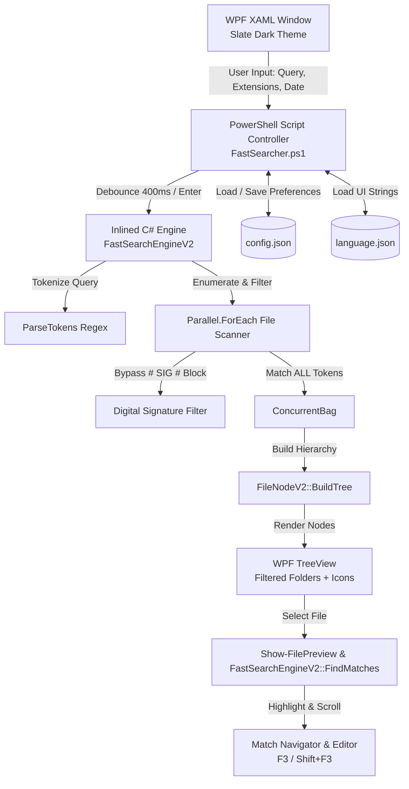
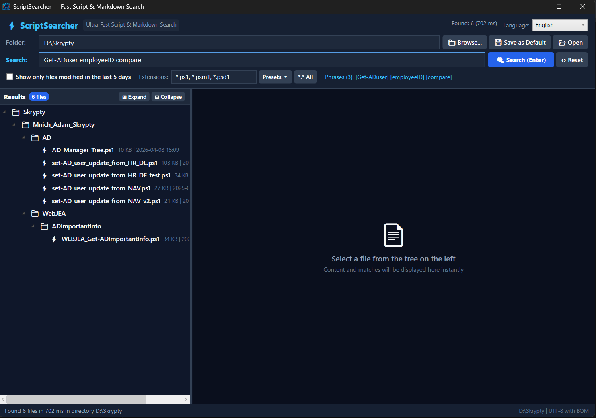
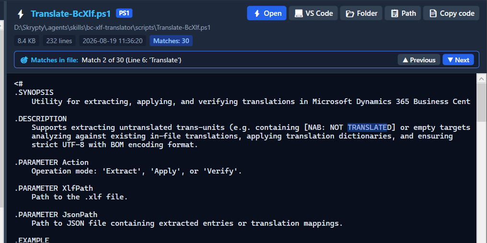
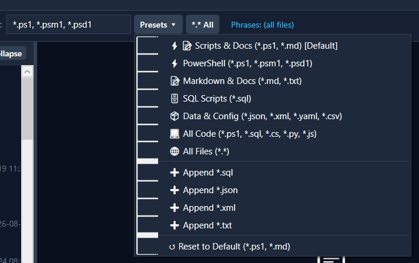

# FastSearcher — Fast Multi-Threaded Search In File Content

[](https://github.com/PowerShell/PowerShell)
[](https://docs.microsoft.com/en-us/dotnet/desktop/wpf/)
[](https://learn.microsoft.com/en-us/dotnet/api/system.threading.tasks.parallel.foreach)
[](https://en.wikipedia.org/wiki/Byte_order_mark)
[](language.json)

**FastSearcher** is an advanced, multi-threaded desktop search application built with PowerShell and WPF in modern Slate Dark Mode. It is designed to scan thousands of scripts, configuration files, and Markdown documents across directory structures (such as `D:\Skrypty`) in **300–600 milliseconds**.

Powered by an in-memory compiled C# parallel search engine ([FastSearchEngineV2](FastSearcher.ps1#L187-L341)), **FastSearcher** delivers instant `ALL` (AND) multi-phrase matching, digital signature filtering, hierarchical tree visualization, in-app syntax previewing with match jumping, dynamic extension presets, and full multi-language UI localization (English, German, and Polish).

---

## Quick File Links

| Component | Path | Description |
| :--- | :--- | :--- |
| **Main Script** | [FastSearcher.ps1](FastSearcher.ps1) | Primary PowerShell WPF application and compiled C# engine |
| **Configuration** | [config.json](config.json) | Persistent application settings and filter preferences |
| **Localization** | [language.json](language.json) | Multi-language catalog (English, German, Polish) |
| **Build Script** | [Build-Exe.ps1](Build-Exe.ps1) | Standalone `.exe` packaging script using PS2EXE |
| **Executable** | [FastSearcher.exe](FastSearcher.exe) | Compiled standalone windowed binary |
| **GUI Screenshots** | [Res/](Res/) | Screenshot assets: [1.png](Res/1.png), [2.png](Res/2.png), [3.png](Res/3.png) |
| **Polish Guide** | [FastSearcher.md](FastSearcher.md) | Original architectural summary and documentation (Polish) |

---

## Key Features

### 1. Ultra-Fast Multi-Threaded C# Engine (`FastSearchEngineV2`)
- **Multi-Core Parallelism**: Uses `Parallel.ForEach` across all available logical CPU cores (`Environment.ProcessorCount`) to inspect file contents concurrently.
- **Sub-Second Latency**: Traverses and searches repositories of 6,000+ files in approximately **300–600 ms**.
- **Digital Signature Stripping**: Automatically detects and excludes cryptographic signature blocks (`# SIG # Begin signature block`) from search evaluations. This prevents false positive hits on common short acronyms (e.g., `BC`, `AD`, `SQL`, `NAV`) caused by random Base64-encoded digital certificates.
- **Large File Safeguard**: Automatically skips text-search inspection on individual files exceeding **25 MB** to protect memory and maintain responsiveness.

### 2. Intelligent Query Parsing & Strict "ALL" (AND) Matching
- **Multi-Word Search**: Typing `BC user compare` matches only files that contain **all three** tokens (any order, in content or file name).
- **Exact Quoted Phrases & Whitespace Preservation**: Supports double (`"AD compare"`) and single (`'AD compare'`) quotes to treat phrases with spaces as atomic search terms. Leading and trailing whitespaces inside quotes (such as `" DR "` or `"dr "`) are **never trimmed**, allowing exact whitespace-delimited targeting.
- **Whole Word Matching**: Dedicated `"Whole word"` checkbox (`chkWholeWord`) restricts search tokens to standalone words bounded by standard word boundaries (`\b` or non-alphanumeric/non-underscore characters). For example, searching `DR` will match `$DR = 1` or `DR test`, but will **not** match `poDRill` or `DR_test`.
- **Same Line (Single Line) Matching**: Dedicated `"Same line"` checkbox (`chkSameLine`) restricts search results to files where **all entered search terms appear on the exact same line** (or in the file name). Uses an ultra-fast zero-allocation anchor scanner that checks candidate files without creating substring copies or array allocations.
- **Typing Search Delay (Debounce)**: Automatic search execution waits for a configurable pause in typing (default **750 ms**, set via `config.json`). While typing, the status bar displays live feedback (`"Typing... search will start shortly"`), preventing premature searches in the middle of typing multi-word phrases. Pressing `Enter` runs the search immediately with zero delay.
- **Punctuation Resilient**: Cleanses delimiters such as commas and semicolons outside quotes (e.g. `BC, user, compare`).
- **Case-Insensitive**: Performs case-agnostic lookups (`StringComparison.OrdinalIgnoreCase`).
- **File Name Inclusion**: A token matches if found either in the file content or in the file name itself.

### 3. Dynamic Date Filter & Presets (All Files by Default)
- **Dynamic DatePicker**: Built-in dark-styled date picker (`dpModifiedSince`) allows selecting any cutoff date for file modifications.
- **Default: All Files**: By default, no date filter is active (`dpModifiedSince.SelectedDate = $null`), searching across all files regardless of age.
- **Quick Presets Menu (`Presets ▾`)**:
  - `📅 All Dates (Default)`
  - `🕒 Today`
  - `⏱️ Last 24 Hours`
  - `📆 Last 3 Days`
  - `📆 Last 5 Days`
  - `📆 Last 7 Days (1 Week)`
  - `🗓️ Last 14 Days (2 Weeks)`
  - `🗓️ Last 30 Days (1 Month)`
  - `🗓️ Last 90 Days (3 Months)`
  - `🗓️ This Year (Since Jan 1)`
  - `↺ Clear / Show All`
- **Instant Clear Button (`✕`)**: Displays dynamically when a date filter is applied, allowing instant 1-click clearing back to all files.

### 4. Dynamic File Extension Filter & Presets
- **Custom Input**: Freeform editable extension box (`txtExtensions`) accepting comma-, semicolon-, or space-separated masks (e.g. `*.ps1, *.md, *.sql`, `.json .yaml`, `*.*`).
- **Extension Normalization**: Automatically converts shorthand inputs (`ps1` or `.ps1`) into valid glob patterns (`*.ps1`) and deduplicates overlapping masks using `HashSet<string>`.
- **Preset Menu (`Presets ▾`)**:
  - `⚡📝 Scripts & Docs (*.ps1, *.md)` [Default]
  - `⚡ PowerShell (*.ps1, *.psm1, *.psd1)`
  - `📝 Markdown & Docs (*.md, *.txt)`
  - `🗄️ SQL Scripts (*.sql)`
  - `📦 Data & Config (*.json, *.xml, *.yaml, *.csv)`
  - `💻 All Code (*.ps1, *.sql, *.cs, *.py, *.js)`
  - `🌐 All Files (*.*)`
  - Quick append actions: `➕ Append *.sql`, `➕ Append *.json`, `➕ Append *.xml`, `➕ Append *.txt`.
- **All Files Toggle (`*.* All`)**: Quick switch button to toggle between full filesystem inspection (`*.*`) and previous specific extension masks.

### 5. Interactive Hierarchical TreeView (`FileNodeV2`)
- **Contextual Pruning**: Only folders that contain matching files are displayed in the tree; empty directory branches are eliminated.
- **File Type Icons**: Dynamic icon rendering based on file extension:
  - ⚡ PowerShell (`.ps1`, `.psm1`, `.psd1`)
  - 📝 Markdown (`.md`, `.markdown`)
  - 🗄️ SQL (`.sql`)
  - 📦 Config & Data (`.json`, `.yaml`, `.yml`, `.toml`)
  - 📰 Markup & Layout (`.xml`, `.html`, `.htm`, `.xaml`)
  - 📋 Text & Logs (`.txt`, `.log`, `.ini`, `.cfg`, `.conf`)
  - 📊 Tabular Data (`.csv`, `.tsv`)
  - 💻 Source Code (`.cs`, `.py`, `.js`, `.ts`, `.cpp`, `.c`, `.h`)
  - ⚙️ Shell Scripts (`.bat`, `.cmd`, `.sh`)
  - 📄 Generic files
- **Subtitles & Badges**: Each file node displays formatted file size (in KB) and last modification timestamp (`yyyy-MM-dd HH:mm`).
- **Tree Expansion Control**: Dedicated `⊞ Expand` and `⊟ Collapse` buttons for global tree navigation.

### 6. Content Previewer & Match Navigation
- **Instant Preview**: Selecting any file in the tree instantly loads its content into a dark monospace editor ([txtPreview](FastSearcher.ps1#L788-L800)).
- **Match Jumping**: Dynamically identifies every occurrence of all query tokens. Clicking `▲ Previous` / `▼ Next` (or pressing `Shift+F3` / `F3`) cycles through matches, scrolls the view directly to the line with 4 lines of context buffer above, and highlights the match token.
- **Persistent Selection**: Uses `IsInactiveSelectionHighlightEnabled="True"` so selection highlights remain clearly visible even when the preview box loses focus.
- **Metadata Card**: Displays file name, extension tag, full directory path, file size, line count, and last write time.

### 7. Multi-Language Localization (i18n)
- Powered by an external JSON translation catalog ([language.json](language.json)).
- Supports **English (`en`)**, **German (`de`)**, and **Polish (`pl`)**.
- Runtime switching via the `Language:` dropdown without requiring an application restart or clearing active search results.
- Built-in fallback mechanism guarantees English defaults if custom keys are absent.

### 8. Modern Slate Dark Theme & Windows DWM Integration
- Crafted with a curated Slate Dark palette (`#0F172A`, `#1E293B`, `#2563EB`, `#38BDF8`).
- Uses Windows DWM P/Invoke ([DwmWindowDarkHelper](FastSearcher.ps1#L47-L64)) to enable immersive dark title bars on Windows 10 (build 17763+) and Windows 11.

---

## Technical Architecture

### Component Diagram



### Inlined C# Classes

The script compiles specialized C# classes using `Add-Type` at startup:

1. **[SearchResultItemV2](FastSearcher.ps1#L76-L83)**:
   Represents an individual matching file with properties: `FullPath`, `FileName`, `RelativePath`, `Extension`, `Length`, and `LastWriteTime`.
2. **[MatchLocationV2](FastSearcher.ps1#L85-L90)**:
   Tracks token positions in text: `Index` (character offset), `Length` (token span), `LineNumber` (1-indexed line), and `Token` string.
3. **[FileNodeV2](FastSearcher.ps1#L92-L185)**:
   Builds the hierarchical directory tree. Contains `BuildTree()`, `GetOrCreateDirNode()`, and recursive directory-first alphabetical sorting (`SortRecursively()`).
4. **[FastSearchEngineV2](FastSearcher.ps1#L187-L341)**:
   - `ParseTokens(string query)`: Tokenizes queries with quote handling.
   - `Search(string rootPath, string[] tokens, bool filter5Days, int daysFilter, string[] extensions)`: Executes multi-core parallel file scanning.
   - `FindMatches(string content, string[] tokens)`: Computes line offsets and exact token match locations for the viewer.
5. **[DwmWindowDarkHelper](FastSearcher.ps1#L51-L63)**:
   P/Invoke wrapper for `dwmapi.dll!DwmSetWindowAttribute` applying `DWMWA_USE_IMMERSIVE_DARK_MODE` (attribute `20` with fallback to `19`).

---

## User Interface Overview

```
+-------------------------------------------------------------------------------------------------------+
| ⚡ FastSearcher  [Ultra-Fast Script & Markdown Search]             Ready (45 files / 312 ms)  [EN v] |
+-------------------------------------------------------------------------------------------------------+
| Folder:     [ D:\Skrypty                                     ] [📁 Browse...] [💾 Set Default] [📂 Open] |
| Search:     [ BC "AD compare"       [x]] [ ] Whole word [ ] Same line  [🔍 Search (Enter) ] [↺ Reset]   |
| Filters:    Modified: [ 2026-09-03 v][x][Presets v]   Extensions: [*.ps1, *.md    ] [Presets v] [*.* All] |
+----------------------------------------+--------------------------------------------------------------+
| Results (45 files)   [⊞ Expand] [⊟ Col]| ⚡ UserSync_NAV.ps1  [PS1]         [⚡ Open][💻 VS Code][📂 Dir] |
+----------------------------------------+ D:\Skrypty\NAV\UserSync_NAV.ps1       [📋 Path][📄 Copy code] |
| v 📁 NAV                               | [ 14.2 KB ]  [ 382 lines ]  [ 2026-09-04 14:20 ] [Matches: 3] |
|   > 📁 Modules                         +--------------------------------------------------------------+
|   ⚡ UserSync_NAV.ps1                  | 🎯 Matches in file: Match 1 of 3 (Line 42: 'BC') [▲ Prev][▼ Next] |
|   📝 Readme.md                         +--------------------------------------------------------------+
| > 📁 ActiveDirectory                   | 39: function Sync-NavUsers {                                  |
|   ⚡ Compare-ADUsers.ps1               | 40:     [CmdletBinding()]                                     |
|                                        | 41:     param(                                                |
|                                        | 42:         [string]$NAVInstance = "BC_PROD", <== MATCH       |
|                                        | 43:         [string]$DomainName   = "CORP"                    |
+----------------------------------------+--------------------------------------------------------------+
| Ready to search.                                                               D:\Skrypty | UTF-8 with BOM |
+-------------------------------------------------------------------------------------------------------+
```

### Controls & Actions Reference

| Control Name | XAML Identifier | Function & Behavior |
| :--- | :--- | :--- |
| **Search Folder** | `txtFolder` | Base directory to scan recursively. Defaults to `D:\Skrypty`. |
| **Browse Button** | `btnBrowse` | Opens folder browser dialog to select a search root. |
| **Save Default** | `btnSaveDefault` | Persists current folder as `SearchFolder` in [config.json](config.json). |
| **Open Folder** | `btnOpenFolder` | Opens the selected directory in Windows Explorer. |
| **Search Input** | `txtSearch` | Query string input with typing debounce delay (default 750 ms), quote parsing, and `Ctrl+F` shortcut. |
| **Clear Search** | `btnClearSearch` | Clears search input and triggers immediate refresh (`✕`). |
| **Whole Word**   | `chkWholeWord` | Restricts matching to complete words bounded by `\b` (e.g. `DR` skips `poDRill`). |
| **Same Line**    | `chkSameLine` | Restricts matching to files where all search terms appear on the same line. |
| **Search Button** | `btnSearch` | Forces immediate search scan (`Enter`). |
| **Reset Filters** | `btnReset` | Clears query, resets date filter to all files, unchecks whole word/same line, and resets extensions. |
| **Modified Since**| `dpModifiedSince` | Dynamic DatePicker to filter files modified on or after chosen date (default: all files). |
| **Clear Date**    | `btnClearDate` | Instantly clears date filter back to all files (`✕`). |
| **Date Presets**  | `btnDatePresets` | Quick date presets menu (Today, 24h, 3d, 5d, 7d, 14d, 30d, 90d, This Year, All). |
| **Extensions Input** | `txtExtensions` | Comma/space/semicolon delimited file mask list (`*.ps1, *.md, *.sql`). |
| **Presets Menu** | `btnExtPresets` | Dropdown menu to replace or append predefined extension packs. |
| **All Files Toggle** | `btnExtAll` | Toggles search between all files (`*.*`) and previous specific extensions. |
| **Results Tree** | `treeResults` | Hierarchical WPF TreeView displaying matching folders and files with icons. |
| **Expand / Collapse** | `btnExpandAll` / `btnCollapseAll` | Expands or collapses all folder branches in the tree. |
| **Preview Box** | `txtPreview` | Read-only dark monospace editor with syntax view and match highlighting. |
| **Match Navigator** | `panelMatchNav` | Previous (`btnPrevMatch`) and Next (`btnNextMatch`) match cycling bar. |
| **Language Select** | `cmbLanguage` | Dynamic language selector (`English`, `Deutsch`, `Polski`). |

---

### GUI Examples & Screenshots

#### 1. Main Search Window & Hierarchical TreeView
The main interface displaying a multi-phrase query (`Get-ADuser employeeID compare`), active extension filters (`*.ps1, *.psm1, *.psd1`), and the pruned directory tree with file size and timestamp metadata:



*Figure 1: Main window searching thousands of files across `D:\Skrypty` in 702 ms, structuring matches into folders and files ([Res/1.png](Res/1.png)).*

---

#### 2. Code Previewer & Match Navigation
Selecting a file in the tree instantly loads its content into the dark monospace editor. The Match Navigator bar lets you jump directly to occurrences with contextual scrolling (4 lines above) and syntax highlighting:



*Figure 2: Preview pane showing `Translate-BcXlf.ps1` with 30 matches, active jump on Match 2 (Line 6: 'Translate'), metadata badges, and IDE quick-launch buttons ([Res/2.png](Res/2.png)).*

---

#### 3. Dynamic Extension Presets Menu
The `Presets ▾` dropdown provides instant switching between curated file sets or appending specific extensions to the active search mask:



*Figure 3: Extension presets menu offering single-click selection of PowerShell, Markdown, SQL, Config, or All Files filters, plus quick-append actions ([Res/3.png](Res/3.png)).*

---

## Query Syntax & Search Rules

### Token Matching Rules

| Query Syntax | Parsing Result | Match Rule |
| :--- | :--- | :--- |
| `BC AD compare` | 3 tokens: `[BC]`, `[AD]`, `[compare]` | File content or file name must contain **all 3 tokens** in any position. |
| `BC "AD compare"` | 2 tokens: `[BC]`, `[AD compare]` | Must contain `BC` AND the exact phrase `"AD compare"`. |
| `param folder` *(with Same line checked)* | 2 tokens: `[param]`, `[folder]` | Must contain both `param` and `folder` on the exact same line in the file. |
| `" DR "` | 1 token: `[ DR ]` | Preserves leading/trailing spaces inside quotes; matches occurrences with whitespace boundaries. |
| `"dr "` | 1 token: `[dr ]` | Preserves trailing space; matches `dr ` (e.g. `# Call dr now`) while skipping words like `draft`. |
| `DR` *(with Whole Word checked)* | 1 token: `[DR]` | Matches whole words only; matches `$DR = 1` or `DR test`, but excludes `poDRill` and `DR_test`. |
| `sqlite 'wal mode'` | 2 tokens: `[sqlite]`, `[wal mode]` | Single quotes also group words into atomic phrases. |
| `NAV, SQL; Backup` | 3 tokens: `[NAV]`, `[SQL]`, `[Backup]` | Commas and semicolons are treated as whitespace separators. |
| *(empty query)* | 0 tokens | Returns all files matching current extension and date filters. |

### Extension Wildcard Formatting

- Extensions can be formatted in any common notation:
  - `*.ps1, *.md` (standard wildcard notation)
  - `.ps1 .md .sql` (leading period shorthand)
  - `ps1, md, json` (plain extension names)
  - `*.*` or `*` (matches all files, guarded by 25 MB content scan limit)

### Digital Signature Exclusion

PowerShell scripts signed with Authenticode contain a certificate block at the bottom:
```powershell
# SIG # Begin signature block
# MIIK+gYJKoZIhvcNAQcCoIIK6zCCCucCAQExCzAJBgUrDgMCGgUAMGkGCisGAQQB
# ... (hundreds of lines of random base64 characters) ...
# SIG # End signature block
```

In standard search tools, random Base64 sequences often match short terms like `AD`, `BC`, `CA`, or `ID`. **FastSearchEngineV2** automatically truncates script content at `# SIG # Begin signature block` before evaluation, ensuring **zero false positives** from certificate payloads.

---

## Configuration (`config.json`)

The application automatically loads and persists state in [config.json](config.json) located in the application directory:

```json
{
  "SearchFolder": "D:\\Skrypty",
  "FileExtensions": [
    "*.ps1",
    "*.md"
  ],
  "FilterModifiedSince": null,
  "FilterModifiedLast5Days": false,
  "DaysModifiedFilter": 5,
  "SearchInSubfolders": true,
  "LastSearchQuery": "Compare-NavObjects",
  "AutoExpandTree": true,
  "FontSize": 13,
  "Theme": "Dark",
  "Language": "en",
  "MatchWholeWord": false,
  "MatchSameLine": false,
  "SearchDebounceMs": 750
}
```

### Configuration Options

| Option | Type | Default | Description |
| :--- | :--- | :--- | :--- |
| `SearchFolder` | `string` | `"D:\\Skrypty"` | Default root folder scanned on startup. |
| `FileExtensions` | `string[]` | `["*.ps1", "*.md"]` | Active file extensions array. |
| `FilterModifiedSince` | `string` | `null` | Cutoff date (`"yyyy-MM-dd"`) for modification filter (`null` = all files). |
| `FilterModifiedLast5Days` | `bool` | `false` | Legacy 5-day filter flag (maintained for backwards compatibility). |
| `DaysModifiedFilter` | `int` | `5` | Legacy day count filter. |
| `SearchInSubfolders` | `bool` | `true` | Enables recursive subdirectory traversal (`SearchOption.AllDirectories`). |
| `LastSearchQuery` | `string` | `""` | Preserves the most recent query string between sessions. |
| `MatchWholeWord` | `bool` | `false` | When true, restricts matches to whole words bounded by word boundaries. |
| `MatchSameLine` | `bool` | `false` | When true, requires all search phrases to appear on the same line. |
| `SearchDebounceMs` | `int` | `750` | Typing delay (milliseconds) before starting search automatically. |
| `AutoExpandTree` | `bool` | `true` | Automatically expands matched tree branches upon search completion. |
| `FontSize` | `int` | `13` | Base font size for editor preview. |
| `Theme` | `string` | `"Dark"` | Application theme identifier. |
| `Language` | `string` | `"en"` | Active language code (`"en"`, `"de"`, `"pl"`). |

---

## Localization System (`language.json`)

The UI is completely separated from hardcoded strings via [language.json](language.json).

### Catalog Schema

```json
{
  "DefaultLanguage": "en",
  "Languages": {
    "en": {
      "DisplayName": "English",
      "Strings": {
        "WindowTitle": "FastSearcher — Fast Search Tool",
        "BtnSearch": "🔍 Search (Enter)",
        "NounFileSingular": "file",
        "NounFileMany": "files"
      }
    },
    "de": {
      "DisplayName": "Deutsch",
      "Strings": { ... }
    },
    "pl": {
      "DisplayName": "Polski",
      "Strings": { ... }
    }
  }
}
```

### Key Functions
- [Import-LanguageCatalog](FastSearcher.ps1#L426-L467): Loads the JSON catalog into `$script:LanguagesCatalog` at startup and establishes fallback defaults.
- [Set-UiLanguage](FastSearcher.ps1#L995-L1059): Re-labels all window titles, buttons, tooltips, context menus, and empty state cards dynamically in memory.
- [Get-UiString](FastSearcher.ps1#L471-L475): Helper function returning the localized string or fallback text.

---

## Standalone Compilation (`Build-Exe.ps1`)

The repository includes a dedicated build script [Build-Exe.ps1](Build-Exe.ps1) that compiles `FastSearcher.ps1` into a standalone Windows executable (`FastSearcher.exe`) using the `ps2exe` module.

### Build Features
- Automatically verifies and installs the `ps2exe` module from the PowerShell Gallery if not present.
- Detects and stops any running instance of `FastSearcher.exe` before compilation to avoid file locks.
- Sets `-STA` (Single-Threaded Apartment) and `-NoConsole` mode for a clean windowed GUI execution.
- Embeds metadata: Product Name, Version (`1.1.0.0`), Company (`Adam Mnich`), and custom icon (`Logo_AM6.ico`).
- Ensures runtime companion files ([config.json](config.json), [language.json](language.json)) exist in the output directory.

### Running the Build

```powershell
# Build FastSearcher.exe in the current folder:
pwsh -NoProfile -ExecutionPolicy Bypass -File ".\Build-Exe.ps1"
```

Or from Windows PowerShell 5.1:
```powershell
powershell -NoProfile -ExecutionPolicy Bypass -File ".\Build-Exe.ps1"
```

---

## Keyboard Shortcuts & Quick Actions

| Shortcut / Action | Scope | Action Performed |
| :--- | :--- | :--- |
| <kbd>Enter</kbd> | Search Box | Triggers immediate search scan |
| <kbd>Ctrl</kbd> + <kbd>F</kbd> | Anywhere in Window | Focuses the search box and selects all query text |
| <kbd>F3</kbd> | Preview Editor | Navigates to the **Next** match in the active file |
| <kbd>Shift</kbd> + <kbd>F3</kbd> | Preview Editor | Navigates to the **Previous** match in the active file |
| **Double Click** | TreeView Node | Opens the selected file in its default Windows application |
| **Right Click** | TreeView Node | Opens context menu: Open, VS Code, Folder, Copy Path, Copy Name |
| `⚡ Open` | Preview Header | Launches the file with default associated program |
| `💻 VS Code` | Preview Header | Opens file in Visual Studio Code (`code -g "<path>"`) |
| `📂 Folder` | Preview Header | Opens file folder in Explorer and selects the file (`explorer.exe /select`) |
| `📋 Path` | Preview Header | Copies absolute file path to Windows Clipboard |
| `📄 Copy code` | Preview Header | Copies entire file text content to Windows Clipboard |

---

## Prerequisites & Compatibility

- **Operating System**: Windows 10 (Version 1809+, build 17763+) or Windows 11 / Windows Server 2019 / 2022.
- **PowerShell Version**: Compatible with **Windows PowerShell 5.1** and **PowerShell 7+ (Core)**.
- **Apartment State**: Requires Single-Threaded Apartment (`-STA`) mode for WPF GUI execution.
  > If launched in MTA mode, the script automatically detects it and respawns itself with `-STA` mode via `Start-Process`.
- **Display Driver / Theme**: Supports Windows DWM Dark Title Bars natively on Windows 10/11.
- **Editor Integration**: Optional integration with `code.exe` (Visual Studio Code). If `code` is not found in `PATH`, fallback opens the file with the default registered handler.

---

## Launch Instructions

### Launch via PowerShell 7+ (Core):
```powershell
pwsh.exe -NoProfile -STA -ExecutionPolicy Bypass -File ".\FastSearcher.ps1"
```

### Launch via Windows PowerShell 5.1:
```powershell
powershell.exe -NoProfile -STA -ExecutionPolicy Bypass -File ".\FastSearcher.ps1"
```

### Launch via Compiled Executable:
```cmd
".\FastSearcher.exe"
```

---

## Author & Specifications

- **Author**: Adam Mnich
- **Encoding Standard**: UTF-8 with BOM (`0xEF, 0xBB, 0xBF`)
- **Compatibility**: PowerShell 5.1 & PowerShell 7+ (Windows)
